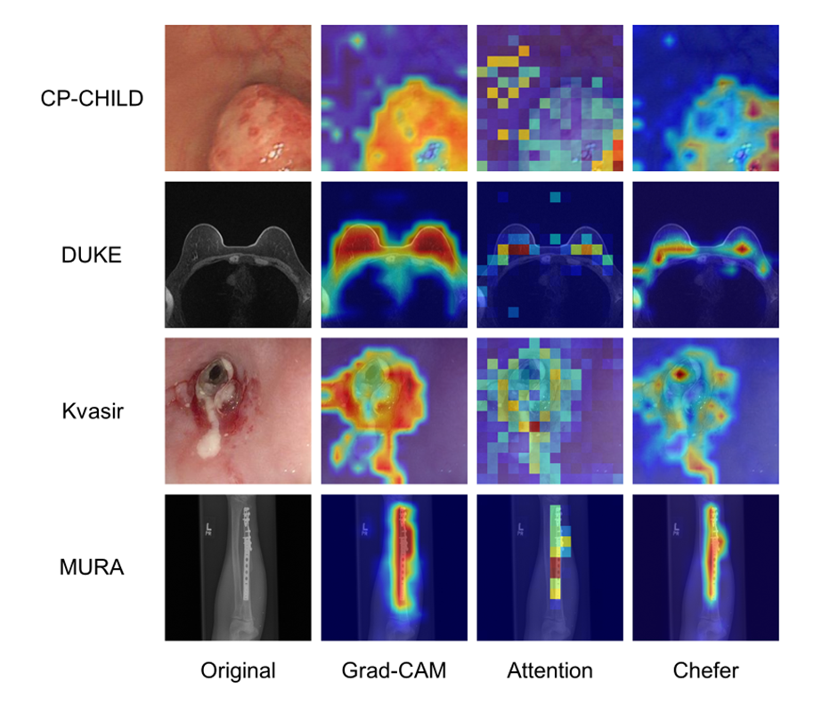

# Attention Maps: A Solution to AI Medical Imaging Interpretability?

This repository contains the implementation of the project _"Are attention maps a solution to the interpretability crisis in AI-assisted medical imaging?"_. In this project, we investigated the reliability of attention maps of the Vision Transformer (ViT) as an interpretability method under the context of medical image diagnosis. This repository provides Python codes to reproduce interpretability results of attention maps and two different methods: [Grad-CAM](https://github.com/jacobgil/pytorch-grad-cam) and the [Chefer method](https://github.com/hila-chefer/Transformer-Explainability).

## Code Usage & Reproduction of the Results

You can run `main.py` to generate interpretability maps and final evaluation results over all datasets and interpretability methods.

The structure of this repository is as follows:
* **Code** - *src/* folder contains necessary python files to generate interpretability maps (including attention maps) and evaluate different interpretability methods.

* **Data** - *data/* folder contains placeholding directories only without any image data. You may follow [the instruction ](https://github.com/ugent-korea/attention_maps/blob/master/reproducibility_tutorial.md) to download medical image datasets that we used.

* **Checkpoints** - *weights/* folder is a placeholding directory as well. `.pth` files of our selected trained models and MAE & DINO pre-trained ViT weights should be put in this directory.

## Training
To evaluate interpretability methods, **ViT-B/16** models are trained to achieve the state-of-the-art benchmark performance for each medical imaging dataset. 4 different initalization methods are used: **random** (i.e., from scratch), **supervised**, **DINO**, and **MAE**. Note that they are pretrained on ImageNet, except for the random initalization. 

### Hyperparameter Settings
The table below shows the hyperparameter settings used to train each model of this project. Saved epoch means the epoch of model selection in which early stopping based on validation loss happened. You can use these to reproduce our training results.
<table>
    <thead>
        <tr>
            <th>Dataset</th>
            <th>Model init.</th>
            <th>Optimizer</th>
            <th>Learning Rate</th>
            <th>Momentum</th>
            <th>Weight Decay</th>
            <th>Scheduler</th>
            <th>Total Epoch</th>
            <th>Saved Epoch</th>
            <th>Batch Size</th>
        </tr>
    </thead>
    <tbody>
        <tr>
            <td rowspan="4">CP-Child</td>
            <td>Random</td>
            <td>Adam</td>
            <td>0.00001</td>
            <td>0.9</td>
            <td>0.0001</td>
            <td>CosineAnnealing</td>
            <td>20</td>
            <td>18</td>
            <td>64</td>
        </tr>
        <tr>
            <td>Sup</td>
            <td>Adam</td>
            <td>0.00001</td>
            <td>0.9</td>
            <td>0.0001</td>
            <td>CosineAnnealing</td>
            <td>20</td>
            <td>5</td>
            <td>64</td>
        </tr>
        <tr>
            <td>DINO</td>
            <td>Adam</td>
            <td>0.00001</td>
            <td>0.9</td>
            <td>0.0001</td>
            <td>CosineAnnealing</td>
            <td>20</td>
            <td>12</td>
            <td>64</td>
        </tr>
        <tr>
            <td>MAE</td>
            <td>Adam</td>
            <td>0.00001</td>
            <td>0.9</td>
            <td>0.0001</td>
            <td>CosineAnnealing</td>
            <td>20</td>
            <td>11</td>
            <td>64</td>
        </tr>
        <tr>
            <td rowspan="4">DUKE</td>
            <td>Random</td>
            <td>SGD</td>
            <td>0.1</td>
            <td>0.3</td>
            <td>0</td>
            <td>CosineAnnealing</td>
            <td>200</td>
            <td>79</td>
            <td>64</td>
        </tr>
        <tr>
            <td>Sup</td>
            <td>SGD</td>
            <td>0.03</td>
            <td>0.1</td>
            <td>0</td>
            <td>CosineAnnealing</td>
            <td>20</td>
            <td>2</td>
            <td>64</td>
        </tr>
        <tr>
            <td>DINO</td>
            <td>SGD</td>
            <td>0.005</td>
            <td>0.1</td>
            <td>0</td>
            <td>CosineAnnealing</td>
            <td>15</td>
            <td>5</td>
            <td>64</td>
        </tr>
        <tr>
            <td>MAE</td>
            <td>SGD</td>
            <td>0.03</td>
            <td>0.1</td>
            <td>0</td>
            <td>CosineAnnealing</td>
            <td>15</td>
            <td>2</td>
            <td>64</td>
        </tr>
        <tr>
            <td rowspan="4">Kvasir</td>
            <td>Random</td>
            <td>SGD</td>
            <td>0.08</td>
            <td>0.1</td>
            <td>0</td>
            <td>CosineAnnealing</td>
            <td>25</td>
            <td>24</td>
            <td>32</td>
        </tr>
        <tr>
            <td>Sup</td>
            <td>SGD</td>
            <td>0.0018</td>
            <td>0.1</td>
            <td>0</td>
            <td>CosineAnnealing</td>
            <td>25</td>
            <td>8</td>
            <td>32</td>
        </tr>
        <tr>
            <td>DINO</td>
            <td>SGD</td>
            <td>0.0012</td>
            <td>0.1</td>
            <td>0.0001</td>
            <td>CosineAnnealing</td>
            <td>25</td>
            <td>20</td>
            <td>32</td>
        </tr>
        <tr>
            <td>MAE</td>
            <td>SGD</td>
            <td>0.02</td>
            <td>0.1</td>
            <td>0.0001</td>
            <td>CosineAnnealing</td>
            <td>25</td>
            <td>25</td>
            <td>32</td>
        </tr>
        <tr>
            <td rowspan="4">MURA</td>
            <td>Random</td>
            <td>SGD</td>
            <td>0.001</td>
            <td>0.9</td>
            <td>0.0001</td>
            <td>CosineAnnealing</td>
            <td>200</td>
            <td>180</td>
            <td>64</td>
        </tr>
        <tr>
            <td>Sup</td>
            <td>SGD</td>
            <td>0.001</td>
            <td>0.9</td>
            <td>0.0001</td>
            <td>CosineAnnealing</td>
            <td>100</td>
            <td>9</td>
            <td>64</td>
        </tr>
        <tr>
            <td>DINO</td>
            <td>SGD</td>
            <td>0.001</td>
            <td>0.9</td>
            <td>0.0001</td>
            <td>CosineAnnealing</td>
            <td>150</td>
            <td>43</td>
            <td>64</td>
        </tr>
        <tr>
            <td>MAE</td>
            <td>SGD</td>
            <td>0.001</td>
            <td>0.9</td>
            <td>0.0001</td>
            <td>CosineAnnealing</td>
            <td>100</td>
            <td>35</td>
            <td>64</td>
        </tr>
    </tbody>
</table>

### Checkpoints
This is another option to reproduce our interpretability results. You can just directly download the checkpoints, put them into *weights/* folder, and load them to run `main.py`.
| Dataset / Method |           Random | Supervised | DINO | MAE |
|------------------|-----------------:|-----------:|-----:|----:|
| CP-Child         |[Download](https://drive.google.com/file/d/12yZ1JxoEnSNuXQIfoWvs-DvN9DaI6ZMp/view?usp=drive_link)|[Download](https://drive.google.com/file/d/1junOUWWRRTPtvauJeIxu1dzwjMtYwOSl/view?usp=drive_link)|[Download](https://drive.google.com/file/d/1zL8fJW69Ze4EfvPt58k2idNJ8kLhVR-c/view?usp=drive_link)|[Download](https://drive.google.com/file/d/1eI38mIIHDod2czM4klsIgf_3tyyimWaJ/view?usp=drive_link)|
| DUKE             |[Download](https://drive.google.com/file/d/16--L8NNOH1z_cKdUNza7riAMw8ngoVxv/view?usp=drive_link)|[Download](https://drive.google.com/file/d/1n7K4EWd0ALQ5RE0dSqL-P8zV-hUfrsVG/view?usp=drive_link)|[Download](https://drive.google.com/file/d/1YGj4B-u3ztB6qz3NA--11KT7_hWJkYIo/view?usp=drive_link)|[Download](https://drive.google.com/file/d/1IBt_X3Rv-GybjquOjcQnyvY0R7oZhTtT/view?usp=drive_link)|
| Kvasir           |[Download](https://drive.google.com/file/d/1HtV6cTiSA7I01_fLIthprQ-ViTPvXCb9/view?usp=drive_link)|[Download](https://drive.google.com/file/d/1dPqiPFOmear24XYUPzsIHT52oF65clMs/view?usp=drive_link)|[Download](https://drive.google.com/file/d/1nAWSTKJ05xeMMq2R05LioVcu1WiDmNmw/view?usp=drive_link)|[Download](https://drive.google.com/file/d/1Kc4rEEfT8w5MIFdhmV9YUyJY3zwH-8Yf/view?usp=drive_link)|
| MURA             |[Download](https://drive.google.com/file/d/1uwGYNym6vnQTxDUtdKTyL_KVmwrNCyJo/view?usp=drive_link)|[Download](https://drive.google.com/file/d/16vpyWh9gfj0TwJZBeNWD1ymcyvkFqpCl/view?usp=drive_link)|[Download](https://drive.google.com/file/d/1Pg2ChmMVHUZqZmhpn1_Jrpyt9VBkocNR/view?usp=drive_link)|[Download](https://drive.google.com/file/d/1nSflcnkNG4dJ2dFaYuipoOFYk76kT9uU/view?usp=drive_link)|

## References

Chefer, H., Gur, S., & Wolf, L. (2021). Transformer Interpretability Beyond Attention Visualization. 
_Proceedings of the IEEE Computer Society Conference on Computer Vision and Pattern Recognition_, 
782–791. https://doi.org/10.1109/CVPR46437.2021.00084

Dosovitskiy, A., Beyer, L., Kolesnikov, A., Weissenborn, D., Zhai, X., Unterthiner, T., Dehghani, M., 
Minderer, M., Heigold, G., Gelly, S., Uszkoreit, J., & Houlsby, N. (2020). An Image is Worth 16x16 
Words: Transformers for Image Recognition at Scale. _arxiv_.
https://doi.org/10.48550/arXiv.2010.11929

Selvaraju, R. R., Cogswell, M., Das, A., Vedantam, R., Parikh, D., & Batra, D. (2017). Grad-CAM: Visual 
Explanations from Deep Networks via Gradient-Based Localization. _Proceedings of the IEEE 
International Conference on Computer Vision_, 618–626. 
https://doi.org/10.1109/ICCV.2017.74
